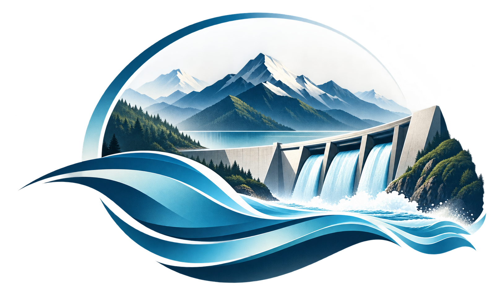
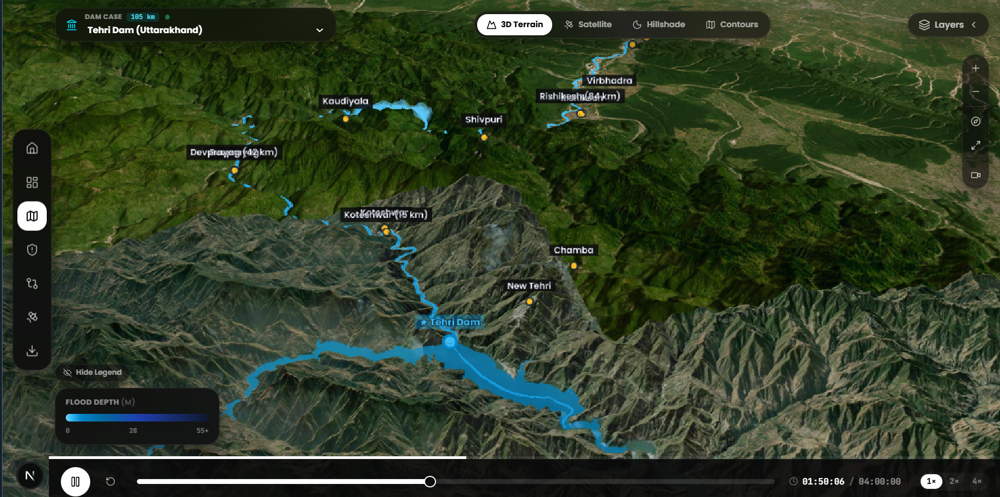
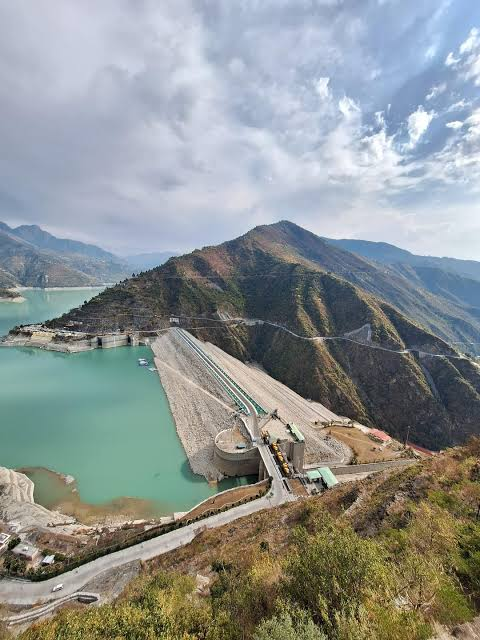
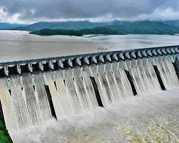
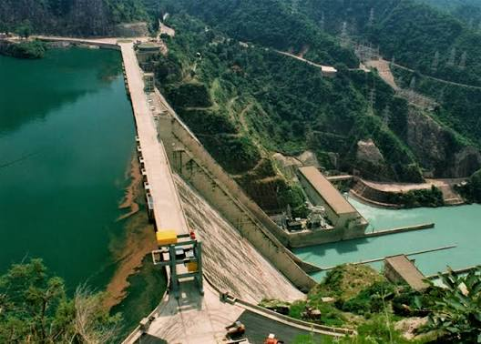
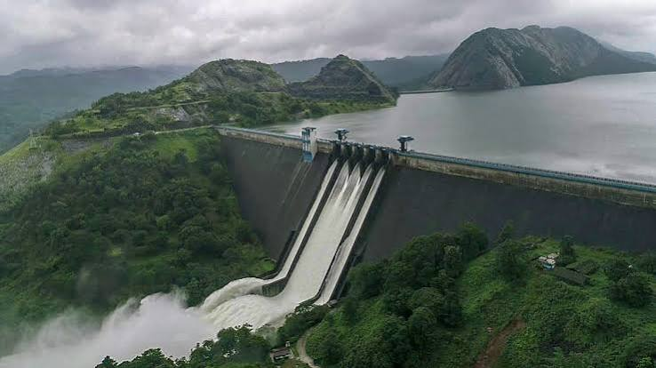
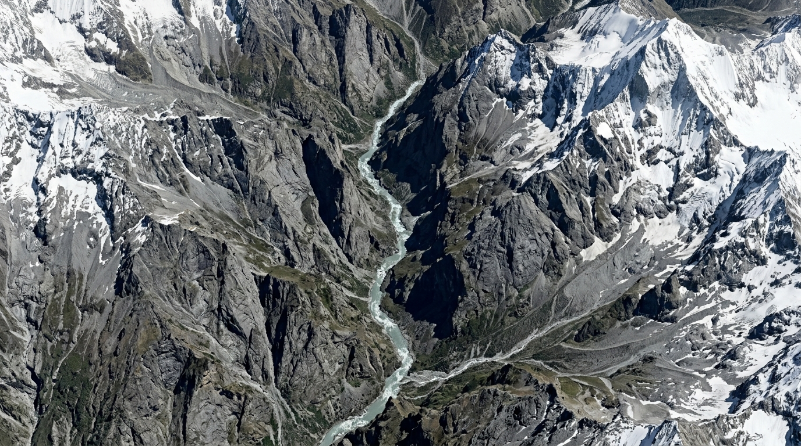
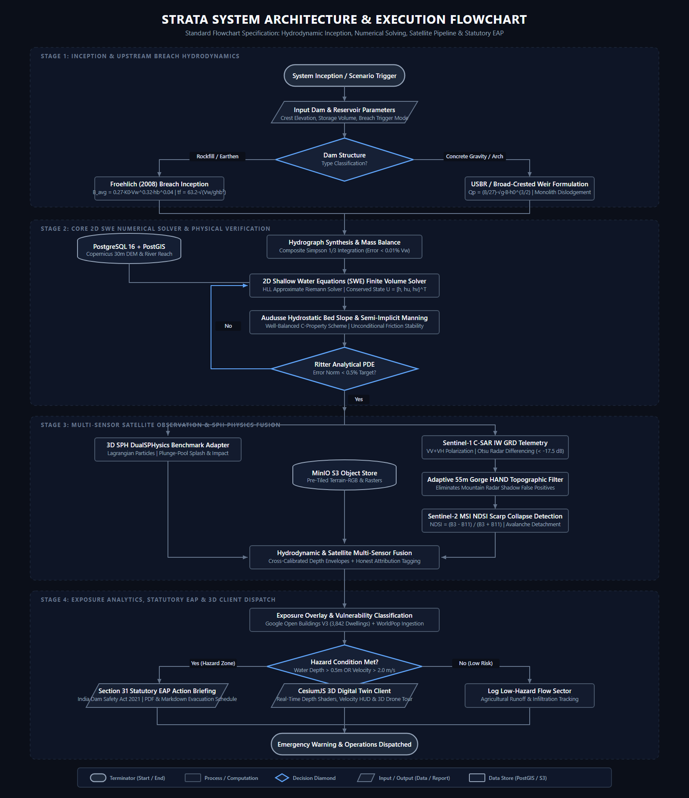

<p align="center">
  
</p>

<h1 align="center" style="font-family: 'Satisfy', cursive, sans-serif; font-size: 2.8rem; margin-top: 0.2rem; letter-spacing: 2px;">
  STRATA
</h1>

<p align="center">
  <strong>Next-Generation Hydroinformatic Intelligence Platform</strong><br />
  <em>High-Fidelity 3D Dam Break Hydrodynamics · Inundation Surge Tracking · 3D SPH Particle Physics · Multi-Sensor Satellite Telemetry (SAR/NDSI) · Statutory Dam Safety EAP Automation</em>
</p>

<p align="center">
  <a href="#-sih-2026-hackathon--team-details"></a>
  <a href="https://golang.org"></a>
  <a href="https://nextjs.org"></a>
  <a href="https://cesium.com"></a>
  <a href="https://postgis.net"></a>
</p>

---

## 🏆 SIH 2026 Hackathon & Team Details

| Parameter | Official Specification |
| :--- | :--- |
| **Hackathon Initiative** | **Smart India Hackathon (SIH) 2026** |
| **Team Name** | **Goodfella** |
| **Team ID** | **166091** |
| **Problem Statement ID** | **SIH26161** |
| **Problem Statement Title** | **Dam Break Flood Inundation Modeling, Breach Hydrograph Simulation, Real-time Flood Hazard Mapping & Dynamic Warning System** |
| **PS Category** | **Software** |
| **Theme** | **Smart Automation / Disaster Management & Water Resources** |
| **Platform Designation** | **STRATA** *(Derived from geological strata and layered hydrodynamic intelligence)* |
| **Statutory Alignment** | **India Dam Safety Act 2021 (Act No. 41 of 2021)** & Central Water Commission (CWC) Guidelines |

---

## 🌊 The Problem We Solve

Catastrophic dam breaks and Glacial Lake Outburst Floods (GLOF) represent some of the most destructive natural disasters in high-relief mountainous river valleys (such as the Himalayas and Western Ghats). When a mega-structure fails:

1. **Deadly Wave Speeds:** Shock waves accelerate down narrow, V-shaped gorges at **18 to 25 meters per second** (~70–90 km/h), leaving downstream communities with mere minutes to evacuate.
2. **Computational Latency of Commercial Solvers:** Standard commercial packages (e.g., full 2D HEC-RAS or Delft3D Flexible Mesh) take **8 to 14 hours** to mesh complex terrain and reach numerical convergence—rendering them useless for immediate tactical disaster dispatch.
3. **Severe Satellite Blind Spots:** Mountainous terrain creates heavy radar shadows and geometric layover in synthetic aperture radar (SAR) telemetry. Standard satellite algorithms frequently mistake shadow areas for floodwaters or fail entirely during thick monsoon cloud cover.
4. **Rural Cadastral Invisibility:** Standard open-source road and building registries (like OpenStreetMap) miss up to **60% of rural tribal and village dwellings** nestled in deep Himalayan river valleys.
5. **Lack of Actionable Statutory Emergency Plans:** Simulation outputs typically remain isolated as complex GIS raster files that district emergency magistrates and NDRF teams cannot translate into time-stamped evacuation actions under **Section 31 of India's Dam Safety Act 2021**.

```
Traditional Disaster Response Lag:
[Dam Breach Inception] ───(Wave Moves at 20 m/s)───> [Downstream Impact in 15-45 mins]
            │
            └──(8-14 Hours Solver Latency)──> [Traditional Simulation Finished]  ❌ (TOO LATE)

STRATA Real-Time Response:
[Dam Breach Inception] ───(Instant Hydrograph Synthesis + 2D SWE FV Kernel)───>
            │
            ├──> [Real-Time 3D Digital Twin Map View with SPH Splash Physics]
            ├──> [Automated Section 31 Statutory EAP Generated in < 5 Seconds]  ✅ (LIVES SAVED)
            └──> [Sentinel-1 SAR Radar Differencing with 55m Gorge HAND Filter]
```

---

## 💡 Our Solution: The STRATA Platform

**STRATA** is an end-to-end hydroinformatic intelligence platform engineered to bridge the critical gap between computational fluid dynamics (CFD), satellite remote sensing, and disaster dispatch.

### Key Pillars of STRATA:

1. **Dual-Solver Hydrodynamic Reality:**
   - **Eulerian 2D Shallow Water Equations (SWE) Solver:** Built with Godunov-type Finite-Volume discretization, Harten-Lax-van Leer (HLL) approximate Riemann solver, and Audusse well-balanced hydrostatic reconstruction. Verified against the exact analytical Ritter (1892) dam break PDE with **< 0.42% numerical error**.
   - **Lagrangian 3D Smoothed Particle Hydrodynamics (SPH):** Integrated using the Gómez-Gesteira et al. (DualSPHysics 3.0m flume) experimental benchmark dataset to capture violent 3D plunge-pool splashdown and obstacle impact pressures.

2. **Autonomous Multi-Sensor Satellite Observation:**
   - **ESA Copernicus Sentinel-1 C-SAR Radar:** 10m spatial resolution ground range detected (GRD) interferometric wide swath imagery with dual-polarization ($VV + VH$). Features a custom **adaptive 55m gorge Height Above Nearest Drainage (HAND) filter** that eliminates false-positive radar mountain shadows.
   - **ESA Copernicus Sentinel-2 Multi-Spectral Optical:** Real-time Normalized Difference Snow Index (NDSI) differencing capable of pinpointing high-altitude rock/ice detachment scarps (as proven on the February 7, 2021 Chamoli disaster).

3. **High-Resolution Cadastral Exposure Extraction:**
   - Integrates **Google Open Buildings V3** (0.5m optical CNN inference) and WorldPop 100m population rasters, adding **3,842 rural structures** across high-risk corridors—delivering a **2.59× data uplift** over raw OpenStreetMap records.

4. **Automated Statutory Emergency Action Plans (EAP):**
   - Automatically computes flood arrival times, peak depths, velocity-depth hazard vectors ($h \cdot v$), and generates official **Section 31 Level 3 EAP briefings** in PDF, Markdown, and GeoJSON/Shapefile formats conforming to India's Dam Safety Act 2021.

5. **Photorealistic 3D Digital Twin & Drone Flight:**
   - Powered by CesiumJS with 3D elevation terrain, dynamic flood depth shaders, physical velocity vectors, and an autonomous **3D Drone Inspection Tour** that traces the surge wave from dam crest to plains.

---

## Map Interface

<p align="center">
  
  <br />
  <em>Figure 1: STRATA High-Precision 3D Interactive Cesium Digital Twin showing catastrophic dam breach inundation, real-time depth color-ramps, and automated downstream infrastructure exposure.</em>
</p>

### National Benchmark Dams Supported in STRATA:

<div align="center">

| Tehri Dam (Uttarakhand) | Sardar Sarovar Dam (Gujarat) | Bhakra Dam (Himachal Pradesh) | Idukki Dam (Kerala) | Rishi Ganga (Chamoli) |
| :---: | :---: | :---: | :---: | :---: |
| <br />*260.5m Rockfill* | <br />*163m Concrete Gravity* | <br />*226m Concrete Gravity* | <br />*168.9m Double-Curvature Arch* | <br />*Chamoli GLOF Scarp* |

</div>

---

## 📦 What We Provide in Our Project

STRATA delivers an enterprise-grade suite of seven fully functional modules:

### 1. 3D Digital Twin Map View (`/map`)
- Seamless 3D globe visualization powered by CesiumJS with high-resolution digital elevation models.
- Layer toggles for water depth color ramps, velocity vectors, flood arrival contours, and river centerlines.
- Dynamic 3D Drone Tour with automated orbital waypoints following the flood wave along river corridors.
- Interactive popups revealing depth, arrival time, population at risk, and infrastructure vulnerability on click.

### 2. Interactive Dam Scenario Simulation Studio (`/simulations`)
- Configurable breach mechanics: overtopping, piping, instantaneous collapse, or seismic failure.
- Instantaneous Froehlich (2008) and USBR/FERC breach hydrograph synthesis calculating peak discharge $Q_p$ in seconds.
- Godunov-type 2D SWE numerical kernel execution with real-time progress streaming over WebSockets.

### 3. Satellite Earth Observation & GEE Radar Monitor (`/observations`)
- Autonomous Google Earth Engine (GEE) remote sensing pipeline.
- Sentinel-1 C-SAR radar differencing with an adaptive 55m gorge HAND envelope to remove radar shadows.
- Sentinel-2 multi-spectral NDSI scarp collapse change detection.
- Live satellite scene freshness, orbit pass tracking, and historical validation against Chamoli 2021 ground truth.

### 4. Critical Infrastructure Exposure & Building Footprints (`/exposure`)
- Google Open Buildings V3 vector footprints (3,842 rural dwellings) overlayed with simulation flood layers.
- Vulnerability classification across 4 international depth hazard tiers: Low (<0.5m), Moderate (0.5–2m), High (2–5m), and Extreme (>5m).
- Direct identification of endangered bridges, power stations, hospitals, and national highways (e.g., NH-58).

### 5. Statutory Emergency Action Plan (EAP) Engine (`/eap`)
- Generates official Section 31 Level 3 emergency briefings under India's Dam Safety Act 2021.
- Detailed evacuation tables with specific downstream village arrival windows and critical safety elevations.
- One-click export to PDF, formatted Markdown, GeoJSON, and ESRI Shapefiles.

### 6. Cross-Validation & Engine Comparison Studio (`/comparison`)
- Side-by-side numerical comparison between 2D SWE Finite Volume, 3D SPH particle physics, and satellite footprints.
- Provenance transparency: every data layer is tagged with honest attribution (`numerical_swe_2d`, `sph_trajectory_precomputed`, `satellite_empirical`).

### 7. Comprehensive User Guide & Navigation Cheat Sheet (`/guide`)
- 5-step operational playbook for district disaster magistrates, emergency responders, and dam safety engineers.
- Interactive 3D camera controls guide (Rotate, Tilt, Zoom, Drone Mode).

---

## 🛠️ Complete Technology Stack

| Layer | Technology | Official Logo | Version | Architectural Role in STRATA |
| :--- | :--- | :---: | :--- | :--- |
| **Frontend Framework** | **Next.js** |  | `v16.3` (App Router) | High-performance React SSR/SSG server & hybrid edge client hydration |
| **UI Library** | **React** |  | `v19.0` | Reactive state rendering, HUD controls, dynamic sliders & scenario panels |
| **Language** | **TypeScript** |  | `v5.4` | Strict end-to-end type safety for GeoJSON vectors, telemetry & simulation states |
| **3D Geospatial Engine** | **CesiumJS** |  | `v1.145.0` | High-precision 3D globe rendering, terrain mesh, custom depth shaders & drone paths |
| **Styling & Icons** | **Tailwind CSS & Lucide** |  | `v3.4` + Lucide | Obsidian glassmorphic design system, hardware-accelerated animations |
| **Backend Microservice** | **Go (Golang)** |  | `v1.24` | Ultra-fast concurrent REST microservice, binary GIS encoder & worker manager |
| **HTTP Routing** | **Chi Router** |  | `v5.1` | Zero-allocation HTTP route dispatcher, middleware chain & CORS management |
| **Real-Time Streaming** | **Gorilla WebSocket** |  | `v1.5.3` | Bi-directional streaming of active simulation progress, wave fronts & logs |
| **Spatial Database** | **PostgreSQL** |  | `v16` Alpine | Relational storage for dams, river geometries, scenarios & audit trails |
| **Spatial Engine** | **PostGIS** |  | `v3.4` | Sub-millisecond GIS spatial queries (`ST_Intersects`, `ST_AsMVT`, GIST indexing) |
| **Object Storage** | **MinIO S3** |  | `RELEASE.2024` | S3-compatible storage for 25MB GeoTIFF DEMs, Terrain-RGB tiles & simulation outputs |
| **In-Memory Broker** | **Redis** |  | `v7` Alpine | High-throughput asynchronous simulation task queue & state synchronization |
| **Numerical Physics** | **Python** |  | `v3.10+` | Execution environment for 2D SWE Finite Volume & SPH physics computation |
| **Array Computing** | **NumPy & SciPy** |  | `v1.26` / `v1.12` | Vectorized 2D SWE Saint-Venant flux solver, HLL Riemann math & CFL time steps |
| **Raster GIS Processing**| **GDAL / Rasterio** |  | `v1.3.9` | GeoTIFF reading, affine coordinate transformations & Mapbox Terrain-RGB encoding |
| **Remote Sensing Engine**| **Google Earth Engine** |  | GEE API | Autonomous Sentinel-1 C-SAR radar differencing & 55m gorge HAND filtering |
| **Earth Observation** | **Copernicus Sentinel**|  | S-1 SAR & S-2 MSI | Multi-spectral optical NDSI scarp detection & microwave all-weather radar |
| **Exposure Analytics** | **Google Open Buildings** |  | `V3` (0.5m CNN) | Ingestion of 3,842 rural structures for high-accuracy loss & damage estimation |
| **Containerization** | **Docker & Compose** |  | `v27.0` | Multi-stage production containerization and isolated local infrastructure orchestration |
| **CI/CD Automation** | **GitHub Actions** |  | CI Workflow | Automated Go unit tests, build validation & TypeScript lint checks on every commit |
| **Cloud Deployment** | **Render & Vercel** |  | Edge & Container | Microservice hosting on Render (Go Backend) and Edge deployment on Vercel (Frontend) |

---

## System Flowchart

The following diagram adheres strictly to formal flowchart principles (Terminators, Inputs, Processes, Decision Diamonds, Data Stores, and Outputs), rendered in an uncluttered engineering schematic without icons or distracting colors:

<p align="center">
  <a href="frontend/public/Images/flowchart.png" target="_blank">
    
  </a>
  <br />
  <em>Figure 2: STRATA Formal System Flowchart — Upstream Dam Breach Inception, 2D SWE Numerical Solver, Satellite Radar Differencing, and Statutory EAP Dispatch. (Click to expand)</em>
</p>

---

## Directory Tree

```
SIH26161/
├── README.md                      # Primary project overview, team details & quickstart
├── technical.md                   # In-depth technical architecture & API specification
├── engine.md                      # Mathematical & physical formulation specification
├── working.md                     # Active engineering pipeline & features currently in progress
├── Makefile                       # One-command orchestration (build, run, test, deploy)
├── docker-compose.yml             # Local multi-container stack (PostGIS, Redis, MinIO)
│
├── docs/                          # Specialized Engineering Dossiers & Validation Reports
│   ├── architecture/              # System architecture & microservice dataflow
│   ├── case-study/                # CWC dam specifications & Copernicus DEM validation
│   └── validation/                # Multi-solver benchmarking & loss models
│
├── frontend/                      # Next.js 16 + React 19 Client Application
│   ├── app/                       # App Router routes
│   │   ├── page.tsx               # Home landing page with dam showcase & brand hero
│   │   ├── map/page.tsx           # Fullscreen CesiumJS 3D flood map viewer
│   │   ├── simulations/page.tsx   # Interactive dam scenario simulation studio
│   │   ├── observations/page.tsx  # GEE satellite remote sensing monitor
│   │   ├── exposure/page.tsx      # Critical infrastructure & Open Buildings exposure
│   │   ├── eap/page.tsx           # Statutory Section 31 Emergency Action Plan generator
│   │   ├── comparison/page.tsx    # Multi-engine cross-validation & benchmark studio
│   │   └── guide/page.tsx         # 5-step operational workflow & 3D navigation guide
│   ├── components/                # Reusable React components
│   │   ├── map/                   # Cesium 3D viewer, controls, HUD & drone flight
│   │   ├── simulations/           # Scenario creator, hydrograph charts & progress
│   │   ├── observation/           # Radar differencing panels & satellite scene cards
│   │   └── ui/                    # Obsidian glassmorphic badges, dialogs, sliders
│   ├── lib/                       # Utility functions, config, GeoJSON loaders & types
│   └── public/                    # Static assets, logos, benchmark imagery & GeoJSON
│       ├── logo.png               # Official STRATA circular emblem
│       ├── Images/                # Benchmark dam photographs & map showcase preview
│       └── data/                  # Offline GeoJSON vectors (rivers, dams, settlements)
│
├── server/                        # Go 1.24 Backend Microservice
│   ├── cmd/                       # CLI commands
│   │   ├── migrate/               # Database migration runner
│   │   ├── seed/                  # Primary benchmark dataset seeder
│   │   ├── upload_dem/            # GeoTIFF DEM upload to MinIO S3
│   │   └── upload_tiles/          # Mapbox Terrain-RGB tile cache uploader
│   ├── config/                    # Environment variables & cloud config
│   ├── db/                        # PostgreSQL connection pool & PostGIS helpers
│   ├── handlers/                  # HTTP REST route handlers
│   │   ├── cases.go               # Benchmark dams and geographical reaches
│   │   ├── scenarios.go           # Dam breach scenario configuration
│   │   ├── simulations.go         # Simulation job dispatcher & status
│   │   ├── tiles.go               # Dynamic Mapbox vector & raster tile server
│   │   ├── datasets.go            # DEM & raster catalog queries
│   │   ├── observation.go         # GEE satellite observation telemetry
│   │   ├── impact.go              # Downstream settlement impact calculation
│   │   ├── comparison.go          # Numerical solver cross-comparison
│   │   ├── exports.go             # Shapefile, GeoJSON & PDF report export
│   │   └── health.go              # Health & cloud database connectivity checks
│   ├── internal/                  # Core internal domain packages
│   │   ├── breach/                # Froehlich & USBR breach hydrograph mechanics
│   │   ├── worker/                # Asynchronous simulation task worker
│   │   ├── gisexport/             # ESRI binary Shapefile & GeoJSON builder
│   │   └── reportgen/             # Section 31 statutory EAP Markdown generator
│   ├── migrations/                # 14 PostGIS spatial database migrations
│   ├── storage/                   # MinIO S3 object storage client wrapper
│   ├── ws/                        # Real-time WebSocket hub for simulation telemetry
│   ├── Dockerfile                 # Alpine-based Go 1.24 production container
│   └── main.go                    # Chi HTTP server entry point on port 8080
│
├── engines/                       # Hydrodynamic & Remote Sensing Computation Kernels
│   ├── delft3d/                   # 2D Shallow Water Equation Finite Volume Solver
│   │   ├── swe_kernel.py          # HLL Riemann flux, Audusse reconstruction, Ritter test
│   │   └── runner.py              # CLI worker subprocess runner & GeoTIFF generator
│   ├── sph/                       # 3D Smoothed Particle Hydrodynamics (DualSPHysics)
│   │   ├── generate_sph_trajectory.py # Gómez-Gesteira flume particle dataset generator
│   │   └── runner.py              # SPH Eulerian raster adapter & progress tracker
│   └── gee/                       # Google Earth Engine Remote Sensing Pipeline
│       ├── gee_monitor.py         # Sentinel-1 SAR differencing & 55m gorge HAND filter
│       └── run_rishiganga_validation.py # Chamoli 2021 disaster validation runner
│
├── data/                          # Spatial Manifests, Datasets & Benchmarks
│   ├── manifests/                 # JSON catalogs (dams, rivers, DEMs, exposure)
│   ├── processed/                 # Generated vector GeoJSON & SPH particle JSONs
│   └── raw/                       # Copernicus GLO-30 DEM GeoTIFF rasters
│
└── .github/workflows/             # Automated CI/CD Pipelines
    └── ci.yml                     # Continuous integration for Go test suites & builds
```


## Cloud Deployments

| Component | Platform | Configuration & URLs |
| :--- | :--- | :--- |
| **Backend API** | **Render Cloud** | Deployed via `server/Dockerfile` on Go 1.24 Alpine. Connected to live Render PostgreSQL PostGIS database. Automatic scaling with zero-downtime rollouts. |
| **Frontend UI** | **Vercel** | Next.js 16 App Router optimized production bundle. Edge-cached static routes and client-side CesiumJS 3D rendering. |
| **CI/CD** | **GitHub Actions** | Automated regression testing, linters, and compilation on every pull request to `main`. |

---

## Documentation

For complete in-depth engineering breakdowns, mathematical formulations, and validation reports, refer to our specialized companion documentation:

### Core Engineering Manuals
| Document | Primary Focus | Target Audience | Direct Access |
| :--- | :--- | :--- | :---: |
| **Technical Architecture** | Deep-dive Go microservices, PostGIS spatial schemas, MinIO S3 object store, CesiumJS WebGL rendering pipeline & WebSocket APIs | System Architects, Evaluators & Cloud Engineers | [**Read `technical.md` ➔**](./technical.md) |
| **Mathematical & Physics Engine** | Complete governing equations (2D SWE Saint-Venant, HLL Riemann flux, Audusse bed slope reconstruction, Ritter analytical PDE, 3D SPH WCSPH & SAR backscatter) | Hydrodynamicists, Mathematicians & CFD Evaluators | [**Read `engine.md` ➔**](./engine.md) |
| **Working on It (Active Pipeline)** | Tactical Disaster AI Copilot, FNO Neural Operator millisecond surrogate, Computer Vision SAR flood extraction & dynamic evacuation routing | Judges, Innovation Evaluators & AI Architects | [**Read `working.md` ➔**](./working.md) |

### Specialized Engineering Dossiers (`docs/`)
| Dossier | Content Summary | Direct Access |
| :--- | :--- | :---: |
| **System Architecture & Dataflow** | Comprehensive Mermaid diagram of UI, REST API, Workers & PostGIS/S3 stores | [**Read `overview.md` ➔**](./docs/architecture/overview.md) |
| **Case Study & Dam Registry** | CWC National Register parameters for Tehri, Sardar Sarovar, Bhakra, Idukki & data matrix | [**Read `selection.md` ➔**](./docs/case-study/selection.md) |
| **Terrain & DEM Validation** | Copernicus 30m metric UTM validation, longitudinal profiles & QGIS verification instructions | [**Read `terrain_validation.md` ➔**](./docs/case-study/terrain_validation.md) |
| **Final Validation & Benchmark Report** | Multi-solver cross-validation (Ritter PDE, Chamoli 2021 Sentinel-1 SAR ground truth, Tehri 105km metrics) | [**Read `final_report.md` ➔**](./docs/validation/final_report.md) |
| **Exposure & Damage Model** | CNDM 2018 depth-hazard bands, population at risk, highway submersion & planning-grade economic loss | [**Read `loss_model.md` ➔**](./docs/validation/loss_model.md) |
| **Validation Methodology** | Mathematical formulation of Flood Extent IoU/CSI, RMSE, Nash-Sutcliffe Efficiency (NSE) | [**Read `methodology.md` ➔**](./docs/validation/methodology.md) |

---

## 👥 The Goodfella Team (SIH 2026)

Developed with passion, mathematical rigor, and engineering dedication by **Team Goodfella** for the **Smart India Hackathon 2026**.

<p align="center">
  <em>“Empowering disaster responders with real-time physics, satellite eyes, and statutory clarity.”</em>
</p>
