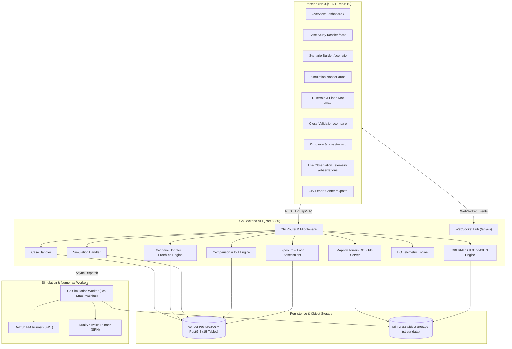

# STRATA Architecture Overview

```mermaid
graph TD
    subgraph UI ["Frontend (Next.js 16 + React 19)"]
        Dashboard["Overview Dashboard /"]
        CaseStudy["Case Study Dossier /case"]
        ScenarioBuilder["Scenario Builder /scenario"]
        RunMonitor["Simulation Monitor /runs"]
        FloodMap["3D Terrain & Flood Map /map"]
        Compare["Cross-Validation /compare"]
        Impact["Exposure & Loss /impact"]
        EO["Live Observation Telemetry /observations"]
        Export["GIS Export Center /exports"]
    end

    subgraph API ["Go Backend API (Port 8080)"]
        Router["Chi Router & Middleware"]
        WSHub["WebSocket Hub (/api/ws)"]
        CaseH["Case Handler"]
        ScenH["Scenario Handler + Froehlich Engine"]
        SimH["Simulation Handler"]
        TileH["Mapbox Terrain-RGB Tile Server"]
        CompH["Comparison & IoU Engine"]
        ImpactH["Exposure & Loss Assessment"]
        ObsH["EO Telemetry Engine"]
        ExportH["GIS KML/SHP/GeoJSON Engine"]
    end

    subgraph Worker ["Simulation & Numerical Workers"]
        SimWorker["Go Simulation Worker (Job State Machine)"]
        DelftRunner["Delft3D FM Runner (SWE)"]
        SPHRunner["DualSPHysics Runner (SPH)"]
    end

    subgraph DataStore ["Persistence & Object Storage"]
        Postgres[("Render PostgreSQL + PostGIS (15 Tables)")]
        S3Storage[("MinIO S3 Object Storage (strata-data)")]
    end

    UI -->|REST API /api/v1/*| Router
    UI <-->|WebSocket Events| WSHub
    Router --> CaseH & ScenH & SimH & TileH & CompH & ImpactH & ObsH & ExportH
    SimH -->|Async Dispatch| SimWorker
    SimWorker --> DelftRunner & SPHRunner
    CaseH & ScenH & SimH & CompH & ImpactH --> Postgres
    TileH & SimWorker & ExportH --> S3Storage
```

